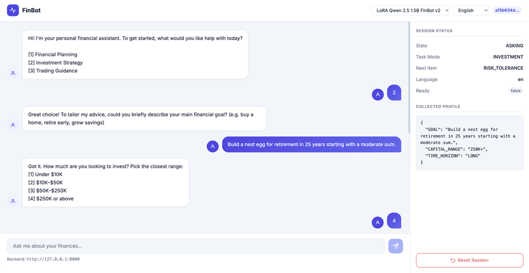
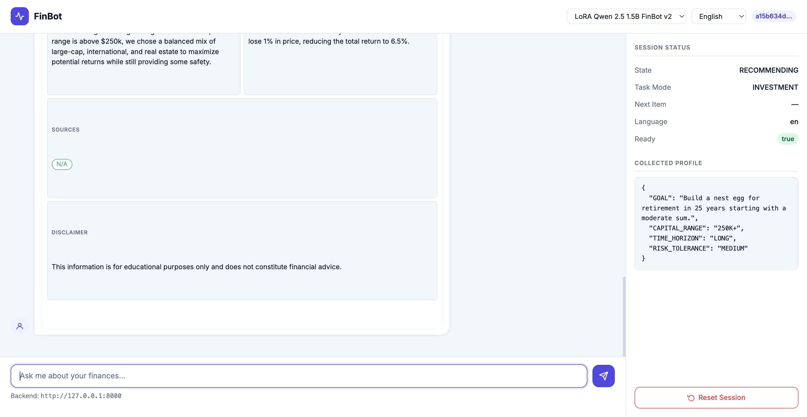
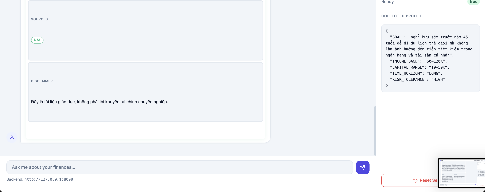
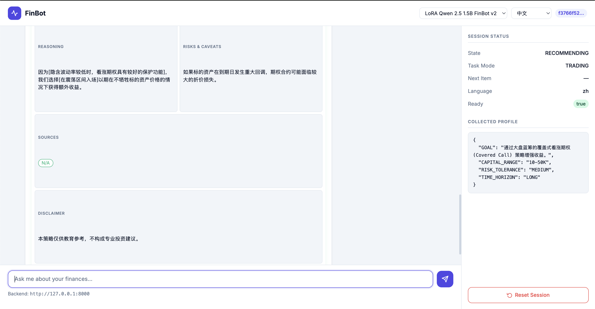
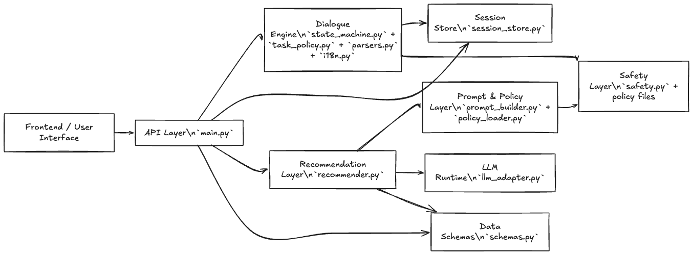

# FinBot: Multilingual Financial Assistant

[](https://github.com/vutuongvy101/finbot-multilingual-lora/actions/workflows/ci.yml)

A smart financial assistant that provides personalized recommendations for planning, investment, and trading through structured multilingual dialogue. Built with a locally deployed fine-tuned LLM and deterministic dialogue engine.

## Key Features

- **Multilingual Support**: Seamless interaction in English, Vietnamese, and Chinese
- **Structured Dialogue**: Deterministic finite-state machine for reliable information collection  
- **Local Deployment**: Runs entirely locally using Qwen2.5-1.5B with LoRA fine-tuning
- **Privacy-First**: Sensitive data is bucketed and processed locally without external API calls
- **Validated Output**: Robust JSON schema validation with automatic repair mechanisms
- **Safety Hardened**: Multilingual prompt-injection defense and PII redaction

## Demo



| English — Investment | Vietnamese — Planning | Chinese — Trading |
|:---:|:---:|:---:|
|  |  |  |

## System Architecture

The system uses a hybrid approach: deterministic components for dialogue management and a single LLM call for final recommendation generation. This design ensures reliability while minimizing computational overhead.



- **Backend**: FastAPI with finite-state dialogue engine
- **Frontend**: Clean browser-based UI with Bootstrap 5
- **Model**: Fine-tuned Qwen2.5-1.5B-Instruct with LoRA adapter — [Adapter available on 🤗 Hub](https://huggingface.co/bibbbu/lora-qwen25-1p5b-finbot-v2)
- **Validation**: Cascading JSON validation and repair pipeline

## Quick Start

### Docker (recommended)

Run the full stack (backend + frontend) with one command:

```bash
cp .env.example .env
# edit .env — set HF_TOKEN for first-time model download

docker compose up --build
```

Open **http://localhost:5500**, select the fine-tuned model (`lora-qwen25-1p5b-finbot-v2`), and click **Load Model**. The Hugging Face cache is persisted in a Docker volume across restarts.

> **Note:** The default image runs in-process Hugging Face inference on CPU (self-contained but slower). For GPU serving via vLLM, see [Inference backends](#inference-backends) below.

### Local development

#### Environment setup

```bash
python -m venv .venv
source .venv/bin/activate
python -m pip install --upgrade pip
pip install -e ".[llm]"
```

#### Configuration

Copy the example env file and set your Hugging Face token (required for first-time model download):

```bash
cp .env.example .env
# edit .env — at minimum set HF_TOKEN
```

The `FINBOT_*` variables already default to the Hub adapter and base model; you only need to change them for custom setups. Adapter available on [🤗 Hub](https://huggingface.co/bibbbu/lora-qwen25-1p5b-finbot-v2). Set `FINBOT_ADAPTER_PATH` only for offline/local use.

#### Start services

```bash
# Backend API
python -m uvicorn finbot.main:app --reload --app-dir src

# Frontend (in another terminal)
cd frontend
python -m http.server 5500
```

Visit `http://localhost:5500`. No `config.js` is needed locally — the frontend defaults to `http://127.0.0.1:8000` for the API.

### Inference backends

`llm_adapter.py` dispatches on `FINBOT_LLM_BACKEND` (`local` | `vllm` | `ollama`):

| Backend | Use case | LoRA support |
|---------|----------|--------------|
| `local` (default) | Laptop dev, Apple Silicon (MPS), CUDA | Hub or local PEFT adapter |
| `vllm` | Production GPU serving | Native LoRA modules |
| `ollama` | Local GGUF runtime | Requires merged/custom model |

#### vLLM (GPU)

Requires an NVIDIA GPU and [nvidia-container-toolkit](https://docs.nvidia.com/datacenter/cloud-native/container-toolkit/install-guide.html):

```bash
cp .env.example .env
# edit .env — set HF_TOKEN

FINBOT_LLM_BACKEND=vllm docker compose --profile vllm up --build
```

vLLM serves the base model with the FinBot LoRA module aliased as `finbot` on port **8001**. The backend calls the OpenAI-compatible API at `FINBOT_VLLM_BASE_URL` (defaults to `http://vllm:8000/v1` inside Docker).

For a standalone vLLM process outside Docker:

```bash
# terminal 1 — vLLM server
docker run --gpus all -p 8001:8000 \
  -e HF_TOKEN=$HF_TOKEN \
  vllm/vllm-openai:latest \
  --model Qwen/Qwen2.5-1.5B-Instruct \
  --enable-lora \
  --lora-modules finbot=bibbbu/lora-qwen25-1p5b-finbot-v2

# terminal 2 — backend
FINBOT_LLM_BACKEND=vllm \
FINBOT_VLLM_BASE_URL=http://127.0.0.1:8001/v1 \
python -m uvicorn finbot.main:app --reload --app-dir src
```

#### Ollama

Merge the LoRA adapter into a single checkpoint, export to GGUF, then create a custom model:

```bash
ollama create finbot -f docker/Modelfile

FINBOT_LLM_BACKEND=ollama \
FINBOT_OLLAMA_MODEL=finbot \
python -m uvicorn finbot.main:app --reload --app-dir src
```

See `docker/Modelfile` for the template. Ollama does not load PEFT adapters directly — you must ship a merged weights file.

## Technical Highlights

- **Teacher-Student Distillation**: Fine-tuned using GPT-5.3 and Gemini-3-Flash generated examples
- **100% Schema Validity**: Achieved perfect structured output compliance after fine-tuning
- **Efficient Inference**: 77% reduction in output length and 43% latency improvement (A100 bf16 eval, n=62)
- **Cross-Platform**: CUDA, Apple Silicon (MPS), Docker, and optional vLLM/Ollama serving

## Project Structure

```
finbot/
├── src/
│   ├── finbot/                  # Core backend modules
│   │   ├── main.py              # FastAPI application
│   │   ├── state_machine.py     # Dialogue flow controller
│   │   ├── parsers.py           # Input/slot parsing utilities
│   │   ├── recommender.py       # Recommendation orchestration
│   │   ├── llm_adapter.py       # Local LLM inference adapter
│   │   ├── prompt_builder.py    # Prompt construction helpers
│   │   ├── policy_loader.py     # Policy file loading
│   │   ├── task_policy.py       # Task-level policy checks
│   │   ├── safety.py            # Safety and refusal pipeline
│   │   ├── i18n.py              # Multilingual response support
│   │   ├── session_store.py     # Conversation/session persistence
│   │   └── schemas.py           # Request/response schemas
│   └── policies/                # Runtime policy documents
├── frontend/                    # Browser-based UI
│   ├── index.html               # Chat interface layout
│   └── app.js                   # Frontend chat logic and API calls
├── docker/                      # nginx config, frontend config, Ollama Modelfile
├── Dockerfile                   # Backend container image
├── docker-compose.yml           # backend + frontend (+ optional vllm profile)
├── tests/                       # Unit tests (parsers, safety, state machine)
├── notebooks/                   # Data prep, training, and evaluation
│   ├── 1_llm_setup__*.ipynb     # Base model loading and setup experiments
│   ├── 2_llm_evaluation_summary.ipynb
│   ├── 3_finetuning_runbook.ipynb
│   ├── 4_prompting_techniques_ablation.ipynb
│   ├── data/                    # Final SFT train/eval JSONL datasets
│   ├── raw_data/                # Domain/language raw samples
│   ├── prompting/               # Prompting ablation CSV outputs
│   ├── eval/                    # Model evaluation JSON reports
│   └── summary/                 # Aggregated metrics and selection notes
├── demo/                        # Demo screenshots by task/language
├── artifacts/                   # HF Hub pointer only (weights not in git)
└── document/                    # Policy/prompt references and diagrams
```

## Tests

Unit tests cover the deterministic core — no GPU, model download, or Hugging Face token required.

```bash
pip install -e ".[dev]"
pytest
```

| Module | What it exercises |
|--------|-------------------|
| `tests/test_parsers.py` | Task-mode parsing (EN/VI/ZH), unknown-answer tokens, profile field validation |
| `tests/test_safety.py` | PII redaction, multilingual prompt-injection detection, goal sanitization |
| `tests/test_task_policy.py` | Field ask-order, recommendation readiness, unknown-field limits |
| `tests/test_state_machine.py` | End-to-end dialogue turns — task selection, invalid answers, skip/clarify flow |

CI runs the same suite on Python 3.10 and 3.12 for every push and pull request (see badge at top).

## Performance

Fine-tuning results on held-out evaluation set (n=62, NVIDIA A100 bf16):
- Schema validity: 0% → 100% 
- Safety compliance: 100% maintained
- Output efficiency: 77% token reduction (638 → 150 mean tokens)
- Latency improvement: 43% faster inference (5134 → 2902 ms)

## License

MIT — see [LICENSE](LICENSE).

For detailed technical documentation, see the [technical report](document/finbot-technical-report.pdf).
