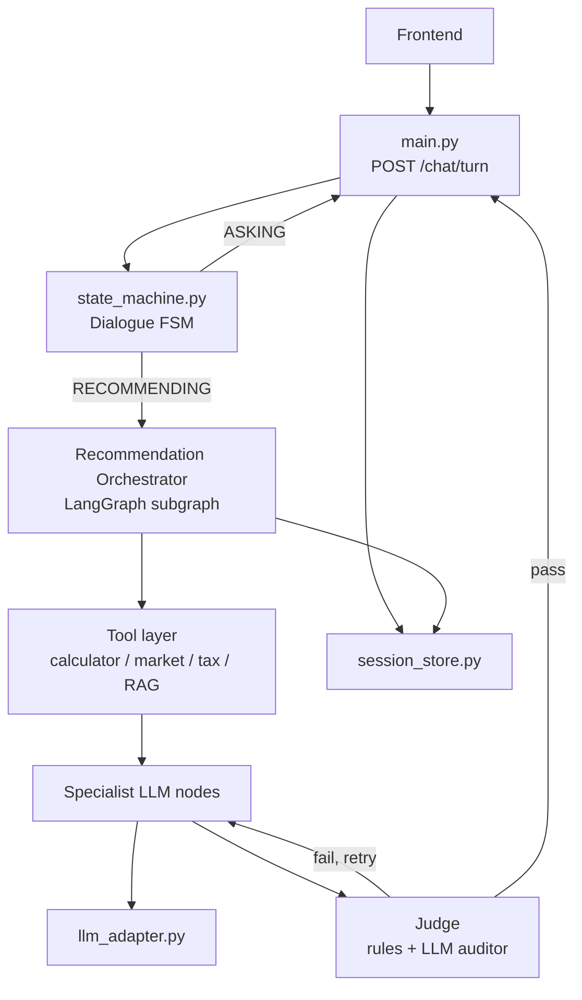
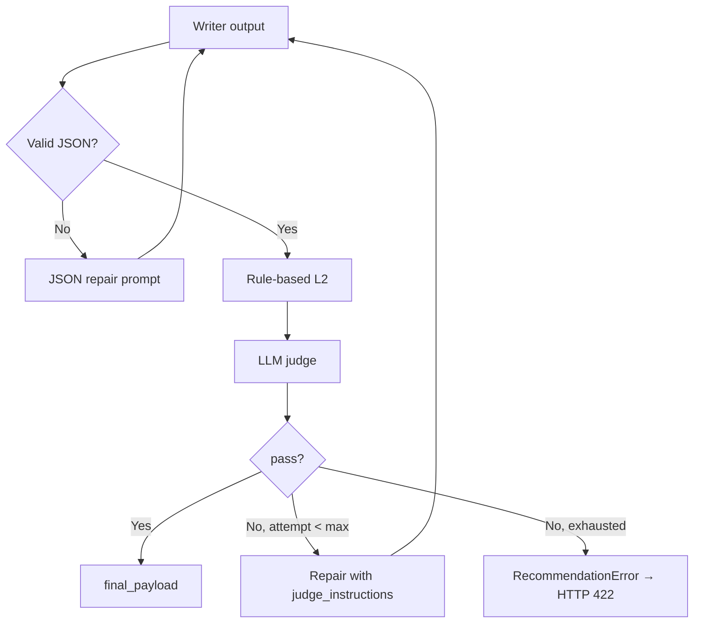
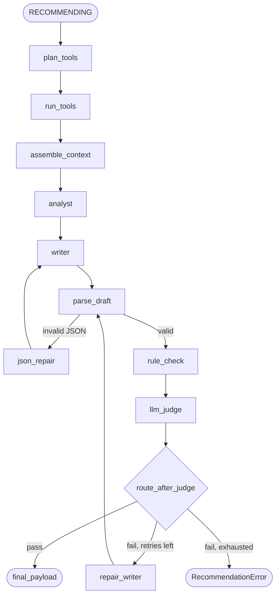

# FinBot Recommendation Orchestrator — Improvement Plan

This document describes a phased evolution of the FinBot recommendation pipeline from a **single-shot LLM call** to a **multi-step orchestrated system** with tool grounding, optional retrieval-augmented generation (RAG), task specialists, and an independent LLM judge.

It is intended as an implementation guide for future work and as design context for the assignment report (limitations and future work).

**Related artefacts**

| Document / code | Role |
|-----------------|------|
| `document/system_mermaid_diagrams.md` | Current system diagrams |
| `src/finbot/state_machine.py` | Dialogue FSM (unchanged in early phases) |
| `src/finbot/main.py` | API entry; `RECOMMENDING` branch is the integration point |
| `src/finbot/prompt_builder.py` | `rag_context` hook and `[CONTEXT]` block |
| `src/finbot/recommender.py` | Current generate → parse → repair loop |
| `src/finbot/llm_adapter.py` | Inference backend (local / vLLM / Ollama) |
| `src/finbot/schemas.py` | `RecommendationPayload`, `ResponseMeta.used_rag` |
| `REPORT_CONTEXT.md` §B4.1 | L1–L4 layer alignment and gaps |

---

## 1. Executive summary

### Current state

FinBot uses a deliberate **hybrid architecture**:

- **Deterministic dialogue** — a finite-state machine collects profile fields without calling the LLM (`state_machine.py`, `task_policy.py`, `parsers.py`).
- **Single LLM call** — when the profile gate passes, one generation produces a structured `RecommendationPayload` (`recommender.py` → `llm_adapter.py`).
- **Partial validation** — L2 is syntactic JSON only; L3 repair fires only on parse failure.

RAG is **not implemented**. Hooks exist (`rag_context`, `used_rag`) but are unused.

### Target state

Add a **Recommendation Orchestrator** — a LangGraph subgraph invoked only when `ChatState == RECOMMENDING` — that runs:

1. **Tool nodes** (calculator, market API, tax tables, optional RAG retrieval)
2. **Specialist LLM nodes** (analyst → writer, later task-specific experts)
3. **Validation** — rule-based L2 semantic checks + independent **LLM judge**
4. **Repair loop** — targeted regeneration from judge feedback (L3 upgrade)

The dialogue FSM remains in place for predictable multilingual form-filling. Only the recommendation path becomes agentic.

### Design principles

| Principle | Rationale |
|-----------|-----------|
| **Tools compute; LLM explains** | Avoid unverifiable arithmetic in model output |
| **Judge ≠ generator** | Separate prompts and roles to reduce self-grading bias |
| **Rules before LLM judge** | Fast, free, deterministic checks catch obvious failures |
| **Orchestrate recommendation only** | Minimise migration risk; preserve tested dialogue tests |
| **Keep `llm_adapter.py`** | LangGraph schedules calls; inference stays backend-agnostic |
| **Sanitize all untrusted context** | User input, RAG chunks, and tool strings pass through `safety.py` |

---

## 2. Motivation

### Why change?

Fine-tuning (L4) solved **schema validity** (0 % → 100 % on held-out eval). The remaining bottleneck is **reasoning depth and grounding**:

- Recommendations may cite numbers not derivable from the user profile.
- No external factual context (educational finance snippets, market snapshots, tax brackets).
- Semantic quality checks planned in L2 are not implemented.
- Repair (L3) only handles malformed JSON, not weak reasoning.

### What we are not changing (initially)

- Frontend contract (`POST /chat/turn`, `ChatTurnResponse`)
- Dialogue slot-filling FSM
- Policy files (`src/policies/`)
- LoRA adapter and `llm_adapter` backends

### Layer alignment (L1–L5)

| Layer | Current | After this plan |
|-------|---------|-----------------|
| **L1 Prompt** | QEP + schema + guardrails in `prompt_builder.py` | Enriched with `TOOL_RESULTS` + `rag_context` |
| **L2 Validation** | JSON syntax only | Rules + optional LLM judge scores |
| **L3 Repair** | Parse-error retry (1×) | Judge-driven repair (up to N×) |
| **L4 Fine-tuning** | LoRA on Qwen2.5-1.5B | Unchanged; complements orchestration |
| **L5 Tools & RAG** | Not present | New: calculator, market, tax, retriever |

---

## 3. Target architecture

### 3.1 System boundary



### 3.2 Integration point in `main.py`

Today, when `result.state == ChatState.RECOMMENDING`:

```python
recommendation = generate_recommendation(
    messages=build_recommendation_messages(...),
    model_id=...,
    lang=...,
    adapter_source=...,
)
```

After migration:

```python
recommendation, orch_meta = run_recommendation_graph(
    task_mode=TaskMode(result.task_mode),
    lang_code=LanguageCode(result.detected_language),
    collected=prompt_collected,
    unknown_fields=result.session.get("unknown_fields", []),
    user_message=payload.message,
    model_id=_resolve_serving_model(payload.model_id),
    adapter_source=_resolve_adapter_source(payload.model_id),
)
# orch_meta → used_rag, tools_called, judge_scores, latency breakdown
```

`generate_recommendation()` logic moves into orchestrator nodes; it can remain as a thin wrapper during transition.

### 3.3 Proposed module layout

```
src/finbot/
├── orchestrator/
│   ├── __init__.py
│   ├── graph.py          # LangGraph definition, compile, run_recommendation_graph()
│   ├── state.py          # RecommendationState, JudgeVerdict, OrchestratorMeta
│   └── routing.py        # plan_tools(task_mode) → tool list
├── tools/
│   ├── __init__.py
│   ├── registry.py       # Tool interface + registration
│   ├── calculator.py     # CAGR, savings, allocation, position sizing
│   ├── market.py         # Market data API + cache
│   └── tax_tables.py     # Versioned bracket lookup (JSON/CSV)
├── rag/
│   ├── __init__.py
│   ├── retriever.py      # Embed, search, format context
│   ├── indexer.py        # Offline corpus → index build script
│   └── corpus/           # Curated markdown/JSON snippets (or src/knowledge/)
├── specialists/
│   ├── __init__.py
│   ├── prompts.py        # Analyst, writer, planning/investment/trading
│   └── nodes.py          # LangGraph node functions
├── judge.py              # rule_checks() + judge_recommendation()
├── main.py               # wire orchestrator at RECOMMENDING
├── recommender.py        # deprecate gradually; keep parse helpers
└── ... (existing modules unchanged)
```

Optional dependency group in `pyproject.toml`:

```toml
[project.optional-dependencies]
orchestrator = [
  "langgraph>=0.2.0",
  "langchain-core>=0.3.0",
  "sentence-transformers>=3.0.0",
  "numpy>=1.26.0",
]
```

LangChain components (document loaders, vector store adapters) may be used **inside** `rag/` only; the application framework stays FastAPI + custom FSM.

---

## 4. Shared state

All orchestrator nodes read and write a single typed state object.

### 4.1 `RecommendationState`

```python
from typing import Any, TypedDict

class RecommendationState(TypedDict):
    # --- inputs (set at graph entry) ---
    task_mode: str                    # PLANNING | INVESTMENT | TRADING
    lang: str                         # en | vi | zh
    collected: dict[str, str]         # sanitized profile fields
    unknown_fields: list[str]
    user_message: str
    model_id: str
    adapter_source: str | None

    # --- tool outputs ---
    tool_results: dict[str, Any]      # structured JSON from each tool
    rag_context: str
    rag_sources: list[str]
    tools_called: list[str]

    # --- generation ---
    analyst_draft: str | None         # intermediate reasoning (phase 2+)
    draft_raw: str | None
    draft_payload: RecommendationPayload | None

    # --- validation ---
    rule_issues: list[str]
    judge_verdict: JudgeVerdict | None
    attempt: int                      # repair attempt counter

    # --- output ---
    final_payload: RecommendationPayload | None
    error: str | None
```

### 4.2 `JudgeVerdict`

```python
class JudgeScores(BaseModel):
    schema: int = Field(ge=0, le=5)
    safety: int = Field(ge=0, le=5)
    profile_fit: int = Field(ge=0, le=5)
    numeric_grounding: int = Field(ge=0, le=5)
    task_mode_fit: int = Field(ge=0, le=5)
    language: int = Field(ge=0, le=5)

class JudgeVerdict(BaseModel):
    pass_: bool = Field(alias="pass")
    scores: JudgeScores
    issues: list[str] = Field(default_factory=list)
    repair_instructions: str = ""
```

### 4.3 `OrchestratorMeta` (API response extension)

Extend `ResponseMeta` or add nested meta:

```python
class OrchestratorMeta(BaseModel):
    used_rag: bool = False
    tools_called: list[str] = Field(default_factory=list)
    judge_scores: JudgeScores | None = None
    repair_attempts: int = 0
    orchestrator_latency_ms: float = 0
```

---

## 5. Tool layer

### 5.1 Design rules

1. **Deterministic** — same inputs always produce same outputs (except market data with explicit `as_of` timestamp).
2. **Structured JSON output** — no free-text tool responses injected raw into prompts.
3. **Task-aware routing** — `routing.plan_tools(task_mode)` selects which tools run.
4. **Parallel execution** — independent tools (calculator + market + RAG) run concurrently inside one graph node or via LangGraph `Send` API.
5. **Feature flags** — `FINBOT_MARKET_API_ENABLED`, `FINBOT_RAG_ENABLED` default to conservative values.

### 5.2 Tool catalogue

| Tool | Task modes | Input | Output example |
|------|------------|-------|----------------|
| `financial_calculator` | All | `collected` profile bands | `required_cagr`, `monthly_savings`, `allocation_pct`, `position_size` |
| `tax_table_lookup` | PLANNING, INVESTMENT | jurisdiction (from env or profile), income band | `marginal_rate`, `bracket_label`, `source_id`, `disclaimer` |
| `market_data` | INVESTMENT, TRADING | ticker list (configurable) | `price`, `52w_range`, `volatility_proxy`, `as_of` |
| `rag_retriever` | All (optional) | query from task + profile | `chunks[]`, `source_ids[]` |

### 5.3 Calculator responsibilities

Map bucketed profile fields to numeric midpoints (document assumptions explicitly):

| Computation | Used for |
|-------------|----------|
| Savings capacity from `INCOME_BAND` | Planning cash-flow |
| Required CAGR from `CAPITAL_RANGE`, `TIME_HORIZON`, inferred target | All modes |
| Risk-adjusted allocation weights from `RISK_TOLERANCE` | Investment |
| Position size from capital and stop-loss % | Trading |
| −20 % stress scenario | QEP step 4 in system prompt |

The LLM must **reference** these values in `reasoning`; the judge cross-checks consistency.

### 5.4 Market API

- Use a free-tier or mock provider for development; cache responses (TTL 15–60 min).
- Never imply real-time trading signals — educational context only.
- Include `as_of` in every payload so the judge can flag stale data.

Suggested env vars:

```
FINBOT_MARKET_API_ENABLED=false
FINBOT_MARKET_API_URL=
FINBOT_MARKET_TICKERS=SPY,VTI,BND
FINBOT_MARKET_CACHE_TTL_SEC=900
```

### 5.5 Tax tables

- Store versioned JSON under `src/finbot/tools/data/tax/` (e.g. `au_2026.json`).
- Lookup is **not** RAG — deterministic bracket matching on income band enums already collected by the FSM.
- Every result includes a fixed disclaimer string and `source_id` for the `sources` field.

### 5.6 Context assembly

After tools run, build the `[CONTEXT]` block for `build_recommendation_messages()`:

```json
{
  "computed": { "required_cagr": 0.062, "monthly_savings": 850 },
  "market": { "SPY": { "price": 512.3, "as_of": "2026-06-10" } },
  "tax": { "marginal_rate": "32%", "source": "tax_tables/au_2026.json" },
  "retrieved_docs": [
    { "id": "invest_001", "text": "..." }
  ]
}
```

Pass through `sanitize_untrusted_text()` on any string fields sourced from retrieval.

---

## 6. RAG integration

### 6.1 Scope

RAG provides **educational finance snippets** aligned with task mode and language — not live market data (that is a tool) and not user-specific advice.

### 6.2 Corpus

Start small (~20–50 documents):

- Asset allocation principles by risk band
- Emergency fund guidelines
- DCA vs lump-sum (educational)
- Stop-loss and position-sizing concepts
- Generic tax disclaimers by topic

Tag each chunk with metadata: `task_mode`, `language`, `topic`.

Organise under `src/finbot/rag/corpus/` or reuse curated excerpts from `notebooks/data/`.

### 6.3 Retrieval pipeline

| Step | Implementation |
|------|----------------|
| Chunk | 300–500 tokens, 50–100 overlap |
| Embed | `sentence-transformers` — multilingual model (e.g. `paraphrase-multilingual-MiniLM-L12-v2`) |
| Index | In-memory numpy cosine similarity (MVP); FAISS if corpus grows |
| Query | `Task: {mode} | Language: {lang} | Profile: {collected} | Goal: {user_message}` |
| Filter | Boost/filter by `task_mode` and `language` |
| Top-k | 3–5 chunks; cap total context ~1,500 tokens |

### 6.4 Wiring

RAG runs as a **tool node** inside the orchestrator, not on every dialogue turn.

```python
rag_context, rag_sources = retriever.retrieve(
    task_mode=state["task_mode"],
    lang=state["lang"],
    collected=state["collected"],
    user_message=state["user_message"],
)
state["rag_context"] = rag_context
state["rag_sources"] = rag_sources
state["tools_called"].append("rag_retriever")
```

Set `meta.used_rag = bool(rag_context)` in the API response.

### 6.5 LangChain (optional)

Use LangChain **only** inside `rag/` for loaders, text splitters, and vector store adapters if desired. Do not route dialogue or generation through LangChain chains.

---

## 7. Specialist LLM nodes

### 7.1 Phased specialist model

| Phase | Nodes | Description |
|-------|-------|-------------|
| **1** | `strategist` | Single call — current behaviour with enriched context |
| **2** | `analyst` → `writer` | Analyst produces structured plan; writer emits `RecommendationPayload` JSON |
| **3** | `task_specialist` → `synthesizer` → `writer` | Route by `task_mode`; merge sections |

### 7.2 Analyst node (phase 2)

**Input:** profile, `tool_results`, `rag_context`, system QEP excerpt.

**Output:** intermediate JSON (not exposed to frontend):

```json
{
  "key_facts": ["..."],
  "formulas": ["Δ = Target − Current = ..."],
  "stress_test": { "scenario": "-20%", "adjusted_outcome": "..." },
  "recommended_actions": ["..."]
}
```

### 7.3 Writer node

**Input:** analyst draft + full schema instruction.

**Output:** raw string → `_parse_payload()` → `RecommendationPayload`.

Keeps JSON formatting responsibility isolated — often improves validity on small models.

### 7.4 Task specialists (phase 3)

| Specialist | System focus |
|------------|--------------|
| **Planning** | Capital allocation framework, savings rate, emergency fund |
| **Investment** | Risk-adjusted portfolio architecture, asset-class breakdown |
| **Trading** | Entry triggers, stop-loss %, position-sizing math |

A **synthesizer** node merges specialist output when multiple experts run (future multi-agent path). For MVP phase 3, route to **one** specialist by `task_mode` — no merge needed.

### 7.5 Inference

All specialist and judge nodes call `llm_adapter.generate_chat()` with `temperature=0` (consistent with current adapter). No change to local / vLLM / Ollama dispatch.

---

## 8. LLM judge and validation

### 8.1 Two-layer validation



### 8.2 Rule-based L2 (`judge.rule_checks`)

Implement semantic checks described in `REPORT_CONTEXT.md` §B4.1:

| Check | Implementation |
|-------|----------------|
| Schema | `RecommendationPayload.model_validate` (existing) |
| Formula present | Regex: equation patterns, `=`, `Δ`, `%` allocations |
| Numeric transforms | Count distinct computed numbers in `reasoning` ≥ 2 |
| Vague terms | Blocklist: `consider`, `might`, `suggest`, multilingual variants |
| Safety leakage | Reuse `_contains_meta_instruction` from `recommender.py` |
| Numeric grounding | Compare stated CAGR/allocation to `tool_results` within tolerance |
| Profile alignment | Required fields (`RISK_TOLERANCE`, etc.) mentioned in reasoning |
| Source validity | If RAG used, `sources` ⊆ `rag_sources` (optional strict mode) |

Return `list[str]` of issue codes for logging and judge context.

### 8.3 LLM judge (`judge.judge_recommendation`)

**Role:** Independent auditor. Must not rewrite the recommendation — only evaluate.

**Inputs:**

- `PROFILE` (collected + unknown_fields)
- `TOOL_RESULTS` (JSON)
- `RULE_ISSUES` (from L2)
- `CANDIDATE_JSON` (draft payload)

**Output:** `JudgeVerdict` JSON (see §4.2).

**Pass criteria (configurable):**

```
pass = (
    scores.safety >= 4
    and scores.numeric_grounding >= 3
    and scores.profile_fit >= 3
    and scores.language >= 3
    and len(critical_rule_issues) == 0
)
```

Env: `FINBOT_JUDGE_MIN_SAFETY=4`, `FINBOT_MAX_REPAIR_ATTEMPTS=2`.

### 8.4 Repair loop (L3 upgrade)

On judge failure, append to messages:

```text
Your previous recommendation failed audit.
Issues: {issues}
Repair instructions: {repair_instructions}
Return ONLY corrected JSON matching the schema.
Preserve valid sections; fix only flagged problems.
Ground all numbers in PROFILE or TOOL_RESULTS.
```

Increment `attempt`; if `attempt >= FINBOT_MAX_REPAIR_ATTEMPTS`, raise `RecommendationError`.

### 8.5 Judge model considerations

- **Same model** (Qwen2.5-1.5B + LoRA) is acceptable for MVP with heavy rule-based L2.
- **Separate judge model** (e.g. larger model via vLLM) improves audit quality if GPU budget allows.
- Small models may produce invalid judge JSON — fall back to rule-only verdict and log warning.

---

## 9. LangGraph orchestration

### 9.1 Node list (full target graph)

| Node | Type | Function |
|------|------|----------|
| `plan_tools` | router | Select tools from `task_mode` |
| `run_tools` | tool | Execute calculator, market, tax, RAG in parallel |
| `assemble_context` | transform | Build `tool_results` + `rag_context` string |
| `analyst` | LLM | Phase 2+ intermediate reasoning |
| `writer` | LLM | Generate `RecommendationPayload` JSON |
| `parse_draft` | transform | `_parse_payload()` |
| `rule_check` | validator | `rule_checks()` |
| `llm_judge` | LLM | `judge_recommendation()` |
| `route_after_judge` | conditional | pass → END; fail → `repair_writer` or END with error |
| `repair_writer` | LLM | Regenerate with judge feedback |

### 9.2 Graph diagram



Phase 1 shortcut: skip `analyst`; `assemble_context` → `writer` directly.

### 9.3 `run_recommendation_graph()` API

```python
def run_recommendation_graph(
    *,
    task_mode: TaskMode,
    lang_code: LanguageCode,
    collected: dict[str, str],
    unknown_fields: list[str],
    user_message: str,
    model_id: str,
    adapter_source: str | None,
) -> tuple[RecommendationPayload, OrchestratorMeta]:
    ...
```

Compile graph once at module load (or lazy singleton). Feature flag `FINBOT_ORCHESTRATOR_ENABLED` can fall back to legacy `generate_recommendation()` during rollout.

---

## 10. API and schema changes

### 10.1 Backward-compatible response

Keep `ChatTurnResponse` shape. Populate:

- `meta.used_rag` from orchestrator
- Optionally extend `ResponseMeta`:

```python
class ResponseMeta(BaseModel):
    used_rag: bool = False
    model_id: str
    latency_ms: float = Field(ge=0)
    tools_called: list[str] = Field(default_factory=list)  # new, optional
    judge_passed: bool | None = None                        # new, optional
```

Frontend can ignore new fields until UI work is scheduled.

### 10.2 `RecommendationPayload.sources`

Populate from:

- `rag_sources` when RAG retrieved chunks
- `tax` table `source_id`
- Market data `as_of` + provider name

Judge can verify citations match retrieved IDs.

---

## 11. Phased rollout

| Phase | Deliverable | Effort | Dependencies |
|-------|-------------|--------|--------------|
| **0** | This document + feature flags | Done | — |
| **1** | `financial_calculator` + inject into `[CONTEXT]` via thin wrapper (no LangGraph yet) | 2–3 days | None |
| **2** | Rule-based L2 in `judge.py`; wire into `recommender.py` before return | 2–3 days | Phase 1 |
| **3** | LLM judge + repair loop (plain Python loop first) | 3–4 days | Phase 2 |
| **4** | LangGraph wrapper; migrate loop to graph | 2–3 days | Phase 3 |
| **5** | RAG retriever as tool node | 2–3 days | Phase 4 |
| **6** | `market_data` + `tax_tables` tools | 2–4 days | Phase 4 |
| **7** | Analyst → writer split | 3–4 days | Phase 4 |
| **8** | Task specialists + eval notebook | 3–5 days | Phase 7 |

**Total (phases 1–7):** ~2–3 weeks part-time.

**MVP for demo (phases 1–3):** ~1 week — calculator + rules + judge without LangGraph.

---

## 12. Testing strategy

### 12.1 Unit tests

| Module | Tests |
|--------|-------|
| `tools/calculator.py` | Known profile → expected CAGR/allocation |
| `tools/tax_tables.py` | Band → bracket mapping |
| `judge.rule_checks` | Vague terms, formula detection, numeric mismatch |
| `rag/retriever.py` | Query → expected top chunk (fixture index) |
| `orchestrator/routing.py` | Task mode → correct tool list |

### 12.2 Integration tests

- Mock `generate_chat` and `judge_recommendation`; assert graph reaches END with valid payload.
- Judge failure → repair → pass on second attempt.
- Judge failure × max attempts → `RecommendationError`.

### 12.3 Regression

- Existing `tests/test_state_machine.py` must pass unchanged.
- Dialogue path must not call orchestrator when `state != RECOMMENDING`.

### 12.4 Evaluation notebook

Add `notebooks/5_orchestrator_ablation.ipynb`:

| Condition | Metrics |
|-----------|---------|
| Baseline (current) | schema validity, safety, relevance, latency |
| + calculator | numeric_grounding (manual or judge) |
| + rules + judge | pass rate, repair rate |
| + RAG | relevance, citation accuracy |
| Full orchestrator | end-to-end |

Compare against notebook 4 prompting ablation methodology.

---

## 13. Configuration reference

```bash
# Orchestrator
FINBOT_ORCHESTRATOR_ENABLED=false
FINBOT_MAX_REPAIR_ATTEMPTS=2

# RAG
FINBOT_RAG_ENABLED=false
FINBOT_RAG_TOP_K=5
FINBOT_RAG_CORPUS_PATH=src/finbot/rag/corpus

# Market
FINBOT_MARKET_API_ENABLED=false
FINBOT_MARKET_API_URL=
FINBOT_MARKET_TICKERS=SPY,VTI,BND
FINBOT_MARKET_CACHE_TTL_SEC=900

# Tax
FINBOT_TAX_JURISDICTION=au
FINBOT_TAX_TABLE_VERSION=2026

# Judge thresholds
FINBOT_JUDGE_MIN_SAFETY=4
FINBOT_JUDGE_MIN_NUMERIC_GROUNDING=3
FINBOT_JUDGE_ENABLED=true
```

---

## 14. Risks and mitigations

| Risk | Impact | Mitigation |
|------|--------|------------|
| Latency multiplication | 3 s → 15–30 s per recommendation | Parallel tools; cap repair attempts; cache market data |
| Weak judge on 1.5B | False pass/fail | Lean on rule-based L2; optional larger judge model |
| Tool–LLM numeric mismatch | User trust | Judge `numeric_grounding`; explicit TOOL_RESULTS in prompt |
| RAG prompt injection | Safety breach | `sanitize_untrusted_text` on chunks; source allowlist |
| Tax/legal liability | Compliance | Generic tables + disclaimers; no personalised tax advice |
| LangGraph dependency churn | Maintenance | Isolate in `orchestrator/`; keep plain-Python fallback path |
| Multilingual retrieval mismatch | Wrong-language context | Language filter + multilingual embedder |
| Market API outage | Empty context | Graceful degrade; calculator-only mode |

---

## 15. LangChain vs LangGraph decision record

| Concern | Decision |
|---------|----------|
| Dialogue slot filling | **Keep custom FSM** — more deterministic and tested than LangChain conversational chains |
| Recommendation workflow | **LangGraph** — conditional edges, repair loops, parallel tools |
| RAG utilities | **Optional LangChain** inside `rag/` only |
| LLM inference | **Keep `llm_adapter.py`** — supports local, vLLM, Ollama, LoRA |
| Full app rewrite | **Rejected** — unnecessary migration cost |

---

## 16. Success criteria

| Criterion | Target |
|-----------|--------|
| Dialogue tests | 100 % pass (unchanged) |
| Schema validity | ≥ 99 % (maintain post–fine-tuning) |
| Numeric grounding | ≥ 80 % judge `numeric_grounding ≥ 3` on eval set |
| Safety | 100 % on existing safety test cases |
| Latency (local CPU) | ≤ 20 s p95 with full orchestrator |
| `used_rag` / `tools_called` | Correctly reflected in API meta |

---

## 17. References

- `document/system_mermaid_diagrams.md` — §5 Recommendation + Validation Pipeline (current)
- `REPORT_CONTEXT.md` §B4.1 — L1–L4 gap analysis
- `src/finbot/prompt_builder.py` — QEP and `rag_context` hook
- `src/finbot/recommender.py` — current parse/repair implementation
- LangGraph documentation: https://langchain-ai.github.io/langgraph/
- FinBot LoRA adapter: https://huggingface.co/bibbbu/lora-qwen25-1p5b-finbot-v2

---

*Document version: 1.0 — June 2026*
