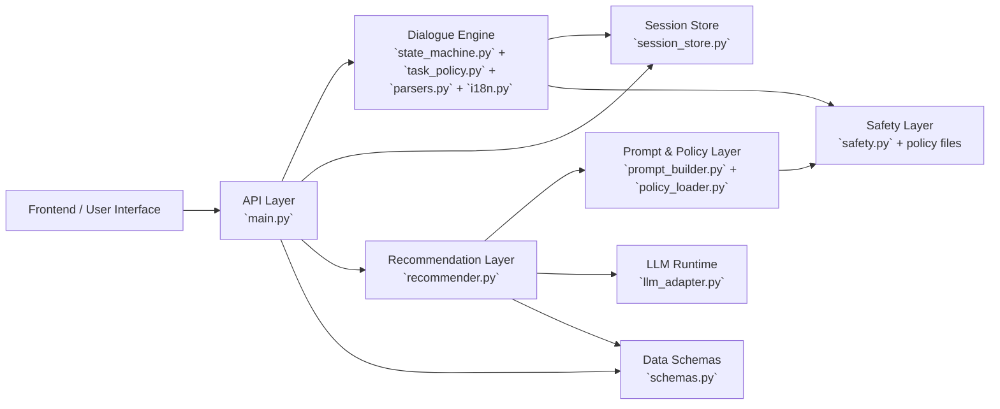
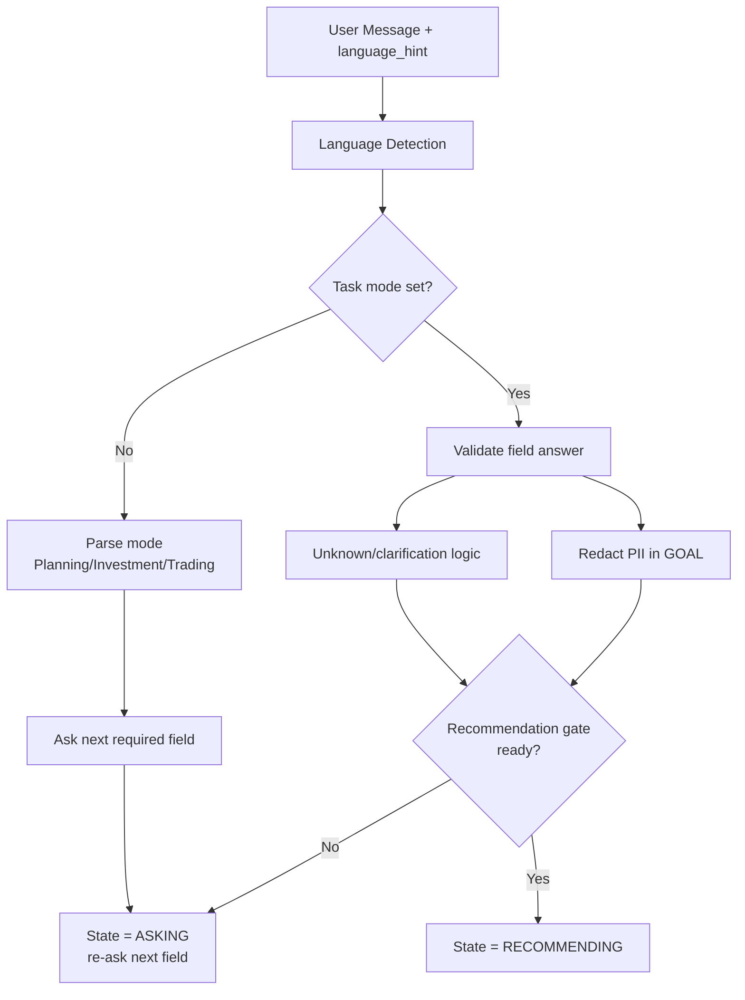
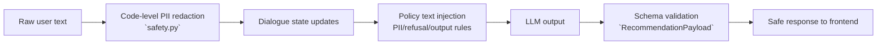

# FinancialBot System Mermaid Diagrams

## 1) Overall Component Diagram



## 2) API + Session Boundary

```mermaid
flowchart TD
    REQ[POST /chat/turn]
    API[FastAPI Handler\n`main.py`]
    STORE[InMemorySessionStore\n`session_store.py`]
    TURN[handle_turn(...)\n`state_machine.py`]
    GEN[generate_recommendation(...)\n`recommender.py`]
    RESP[ChatTurnResponse\n`schemas.py`]

    REQ --> API
    API --> STORE
    STORE --> API
    API --> TURN
    TURN --> API
    API --> GEN
    GEN --> API
    API --> STORE
    API --> RESP
```

## 3) Dialogue Engine (State + Collection)



## 4) Prompt + Safety Assembly

```mermaid
flowchart TD
    COLLECTED[Collected profile fields]
    UNKNOWN[unknown_fields]
    POLICYLOAD[load_policies()\n`policy_loader.py`]
    PII[pii_rules.md]
    REFUSAL[refusal_topics.md]
    OUTPUT[output_rules.md]
    BUILD[build_recommendation_prompt()\n`prompt_builder.py`]
    PROMPT[Final Prompt Text\nSYSTEM + PROFILE + INSTRUCTION + JSON schema]

    PII --> POLICYLOAD
    REFUSAL --> POLICYLOAD
    OUTPUT --> POLICYLOAD
    COLLECTED --> BUILD
    UNKNOWN --> BUILD
    POLICYLOAD --> BUILD
    BUILD --> PROMPT
```

## 5) Recommendation + Validation Pipeline

```mermaid
flowchart TD
    PROMPT[Prompt Input]
    GEN[LLM generate()\n`llm_adapter.py`]
    PARSE[_parse_payload()\n`recommender.py`]
    VALID{Valid RecommendationPayload?}
    RETRY[One repair retry]
    FB[Fallback safe payload]
    NATURALIZE[Profile summary cleanup]
    OUT[RecommendationPayload]

    PROMPT --> GEN --> PARSE --> VALID
    VALID -- Yes --> NATURALIZE --> OUT
    VALID -- No --> RETRY --> GEN
    RETRY --> GEN
    RETRY --> PARSE
    VALID -- No again --> FB --> OUT
```

## 6) Safety Controls (Cross-Cutting)


